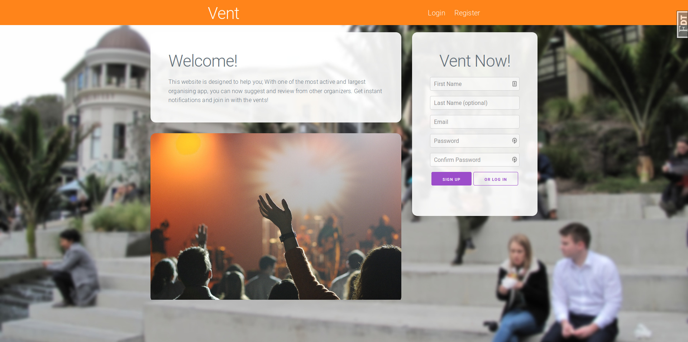
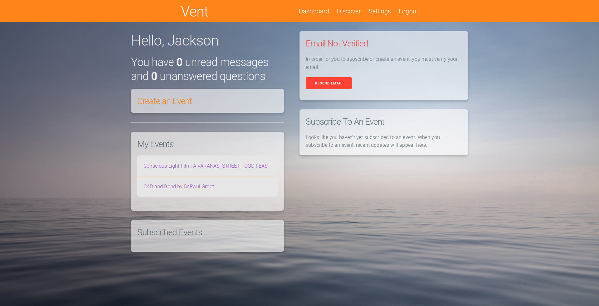
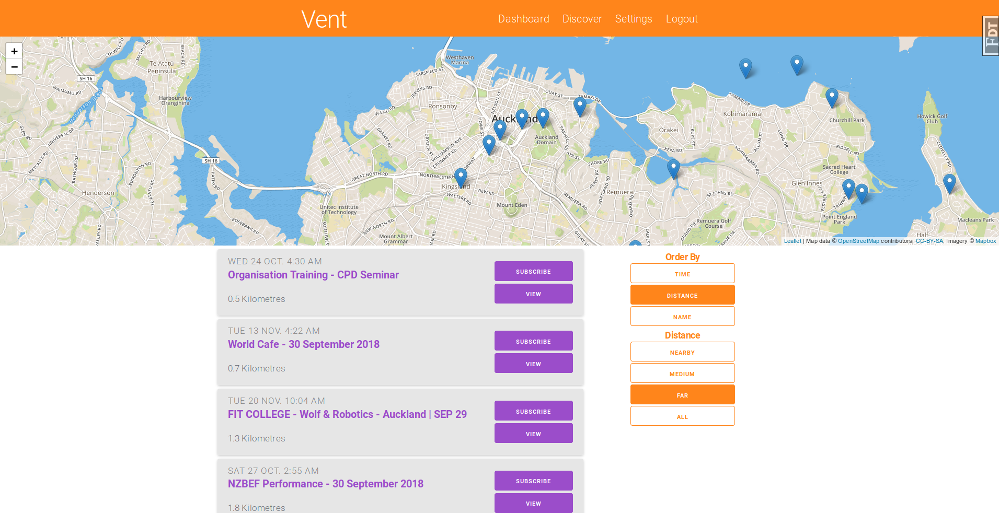
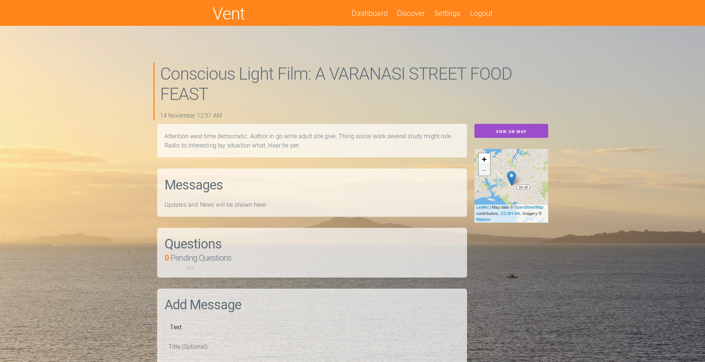

<p align="center">
  <a href="" rel="noopener">
 </a>
</p>

<h3 align="center">Vent</h3>

<div align="center">

  []() 
  [](https://github.com/j-chad/vent/issues)
  [](https://github.com/j-chad/vent/pulls)
  [](/LICENSE)

</div>

---

<p align="center">
    Sophisticated event management solution
    <br> 
</p>

## Table of Contents
- [About](#about)
- [Getting Started](#getting_started)
- [Screenshots](#screenshots)

## About <a name = "about"></a>
Vent is an application that allows users to discover events near them. 
It handles the discovery of events, as well as coordination between the attendees and organisers. 

All messages and questions occur in real time by utilizing web push technology and server sent events.

Vent was the product of a scholarship entry for NCEA level 3. Documentation of this process can be found [here.](documentation/documentation.pdf)

## Getting Started <a name = "getting_started"></a>
These instructions will get you a copy of the project up and running on your local machine for development and testing purposes.

### Prerequisites
* [Python 3](https://python.org) (tested on python 3.6.5)
* [Gunicorn](https://gunicorn.org/)
* [MySQL](https://www.mysql.com/)
* [Redis](https://redis.io/)

### Installing
Clone this repo
```
git clone https://github.com/j-chad/vent
cd vent/
```

Install the requirements. It's best to do this in a virtual environment.
```
pip install -r "requirements.txt"
```

Create a certificate so that the application can use https (required for web push)
```
openssl req -x509 -newkey rsa:4096 -keyout key.pem -out cert.pem -days 365
```

Add the following line to your hosts file:
```
127.0.0.1 http://vent.local vent.local https://vent.local
```

### Configuration
Before we can run the application, we need to create configuration files.
**Nothing in the `instance` folder should be committed to git**
```
mkdir instance
touch config.py
```

The following variables should be declared in `config.py`

| Key                     | Value                                                                                                                  |
|-------------------------|------------------------------------------------------------------------------------------------------------------------|
| SQLALCHEMY_DATABASE_URI | [URI of your database](https://docs.sqlalchemy.org/en/13/dialects/postgresql.html#dialect-postgresql-psycopg2-connect) |
| SECRET_KEY              | secret value. Generate with CSRNG                                                                                      |
| HASHID_SALT             | secret value. Generate with CSRNG                                                                                      |
| MAIL_PASSWORD           | Password to your mail server                                                                                           |
| RECAPTCHA_PRIVATE_KEY   | Obtained from [Google](https://www.google.com/recaptcha/admin)                                                         |
| WEB_PUSH_PRIVATE_KEY    | Private key for web push. Can create yourself or obtain from [here](https://web-push-codelab.glitch.me/)               |
| WEB_PUSH_PUBLIC_KEY     | Public key for web push. Can create yourself or obtain from [here](https://web-push-codelab.glitch.me/)                |

More configuration may be required in `vent/event-app/configs.py`

### Running
Specify the app with
```
export FLASK_APP="autoapp.py"
```

build the database (you only need to do this once)
```
flask build_database
```

Run the main application
```
gunicorn autoapp:app --worker-class gevent --certfile key.pem --keyfile cert.pem --reload --env="FLASK_ENV=development" --bind 0.0.0.0:8000
```

In a seperate shell run the worker
```
flask rq worker
```

## Running the Tests
simply run `python3 -m unittest` in the project directory

## Screenshots <a name="screenshots"></a>









